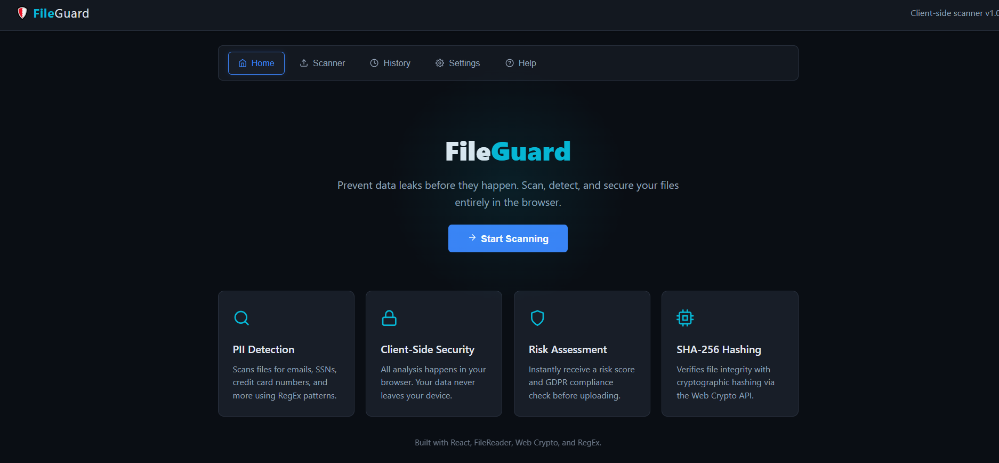

# 🛡️ FileGuard

**Client-Side Secure File Analyzer & Data Leak Prevention**

FileGuard is a browser-based cybersecurity project that analyzes files for sensitive information before they are uploaded or shared. The application scans files locally in the browser, detects common types of personally identifiable information (PII), verifies file integrity using SHA-256 hashing, and evaluates the overall security risk based on configurable policies.

The project demonstrates how browser APIs such as the FileReader API and Web Crypto API can be used to build privacy-focused security tools without requiring a backend or transmitting user data.

> ⚠️ This is an educational and portfolio project. All analysis is performed locally in the browser using rule-based detection techniques.

---

## ✨ Features

* Scan files locally without uploading them to a server
* Detect common PII patterns including email addresses, phone numbers, IP addresses, credit card numbers, and Social Security numbers
* Generate SHA-256 file hashes using the Web Crypto API
* Calculate a security risk score with severity levels and recommendations
* Configure security policies such as maximum file size, allowed file types, blocked extensions, and risk thresholds
* Preview supported text files before scanning
* View scan history stored locally using `localStorage`
* Animated scanning workflow with terminal-style scan logs and smooth UI transitions
* Help page explaining the scanning process, technologies, and security policies

---

## 📸 Screenshots

> *Click to expand each screenshot.*

<details>
<summary>🏠 Home Page</summary>


</details>

<details>
<summary>🔎 Scanning in Progress</summary>


</details>

<details>
<summary>📊 Results – Risk Assessment</summary>


</details>

<details>
<summary>⚙️ Settings</summary>


</details>

<details>
<summary>📚 History</summary>


</details>

<details>
<summary>📚 Help</summary>


</details>


---

## 🖥️ Tech Stack

* React 18
* Vite
* CSS
* Framer Motion
* React Icons
* Web Crypto API
* FileReader API
* JavaScript Regular Expressions (RegEx)

Frontend only. No backend, database, or authentication is required. All processing is performed locally in the user's browser.

---

## 🚀 Getting Started

**Prerequisites:** Node.js installed on your machine.

```bash
# Clone the repository
git clone <your-repository-url>

# Enter the project directory
cd fileguard

# Install dependencies
npm install

# Start the development server
npm run dev
```

Open the local URL displayed in your terminal (typically `http://localhost:5173`).

To create a production build:

```bash
npm run build
npm run preview
```

---

## 📖 How It Works

1. Select or drag a file into the application.
2. The file is validated against the configured security policies.
3. Supported text files can be previewed before scanning.
4. During analysis, the application:

   * Generates a SHA-256 hash using the Web Crypto API
   * Reads the file locally using the FileReader API
   * Searches for sensitive information using RegEx-based detection
   * Calculates an overall security risk score
5. Results are presented with detected findings, file metadata, and recommendations.
6. Completed scans are stored locally so previous analyses can be reviewed later.

---

## 📂 Project Structure

```text
src/
├── components/
│   ├── UploadPanel/
│   ├── AnalysisPanel.jsx
│   ├── HistoryPanel.jsx
│   ├── HelpPage.jsx
│   ├── HomePage.jsx
│   ├── Navbar.jsx
│   ├── PrivacyPanel.jsx
│   ├── RiskGauge.jsx
│   ├── RiskPanel.jsx
│   ├── ScanLog.jsx
│   ├── SettingsPanel.jsx
│   └── Skeleton.jsx
├── context/
│   └── AppContext.jsx
├── utils/
│   └── fileAnalyzer.js
├── securityPolicies.js
├── App.jsx
└── main.jsx
```

---

## 🗺️ Future Enhancements

* Support additional PII patterns such as passport numbers and IBANs
* Batch scanning for multiple files
* Automatic redaction of detected sensitive information
* Background scanning using Web Workers
* Optional AI-assisted content classification using a local model

---

## 📚 References

* OWASP Top 10 for Large Language Model Applications
* NIST AI Risk Management Framework
* MDN Web Crypto API Documentation
* MDN FileReader API Documentation

---

## 📄 License

This project is intended for educational and portfolio purposes.
